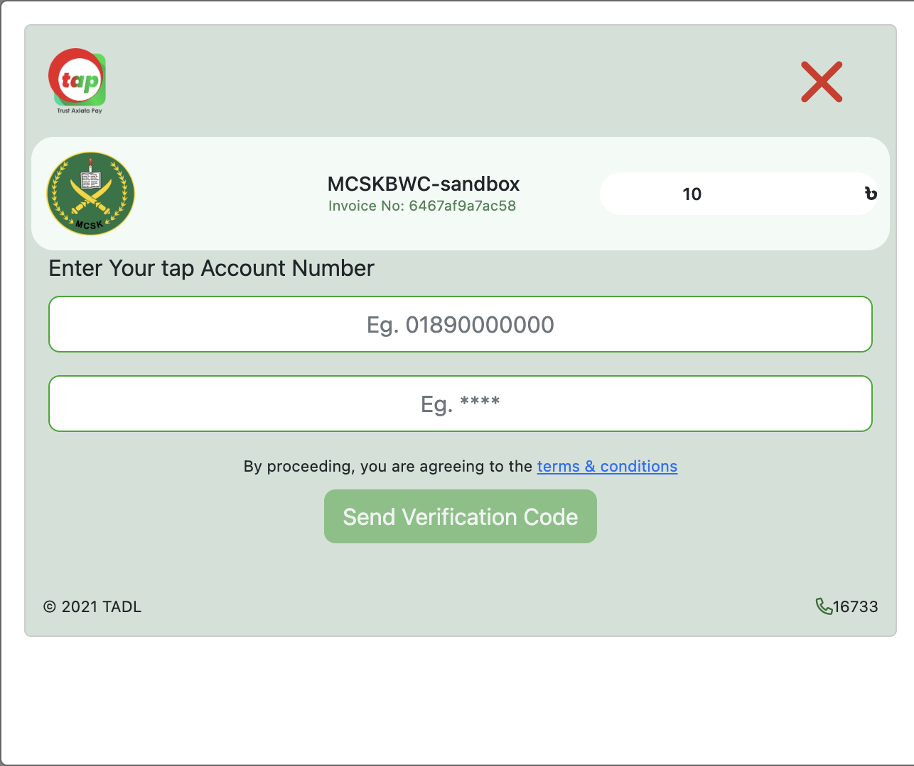
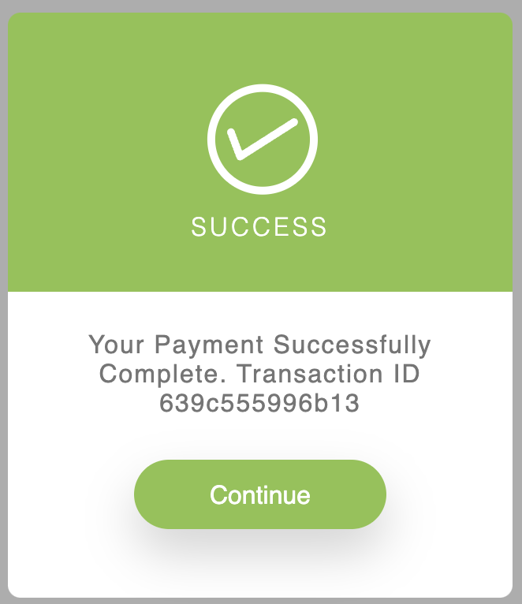
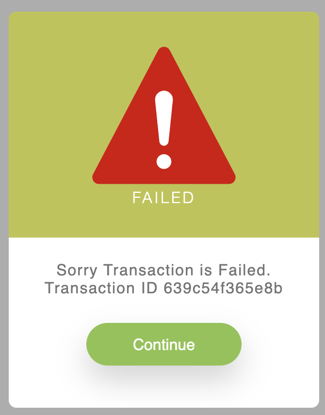

# Trust Axiata Pay (TAP) Payment Gateway for PHP/Laravel Framework

[](https://packagist.org/packages/karim007/laravel-tap)
[](https://packagist.org/packages/karim007/laravel-tap)

## Requirements

- PHP >=7.4
- Laravel >= 6


## Installation

```bash
composer require karim007/laravel-tap
```

## Examples






### vendor publish (config)

```bash
php artisan vendor:publish --provider="Karim007\LaravelTap\LaravelTapServiceProvider" --tag="config"

```
After publish config file setup your credential. you can see this in your config directory tap.php file
```
"sandbox"         => env("TAP_SANDBOX", true),

"authAPIKey"     => env("TAP_AUTH_API_KEY", ""),
"auth_token" => env("TAP_AUTH_TOKEN", ""),
"username"      => env("TAP_USERNAME", ""),
"password"     => env("TAP_PASSWORD", ""),

"authAPIKey_2"     => env("TAP_AUTH_API_KEY_2", ""),
"auth_token_2" => env("TAP_AUTH_TOKEN_2", ""),
"username_2"      => env("TAP_USERNAME_2", ""),
"password_2"     => env("TAP_PASSWORD_2", ""),

//so on ...

"callbackURL"     => env("TAP_CALLBACK_URL", "http://127.0.0.1:8000/tap/callback"),

```

### Set .env configuration
```
TAP_SANDBOX=true  #for production use false

TAP_AUTH_API_KEY=""
TAP_AUTH_TOKEN=""
TAP_USERNAME=""
TAP_PASSWORD=""

#for multi account
TAP_AUTH_API_KEY_2=""
TAP_AUTH_TOKEN_2=""
TAP_USERNAME_2=""
TAP_PASSWORD_2=""

#so on just use _number likes _3, _4, _5

TAP_CALLBACK_URL=""
```

## Usage
### 1. publish a controller
```
php artisan vendor:publish --provider="Karim007\LaravelTap\TapPaymentController" --tag="controllers"

```

### 2. you need to add on route list
```php
    Route::get('/tap/create-payment', [App\Http\Controllers\TapPaymentController::class,'createPayment'])->name('tap-create-payment');
    Route::get('/tap/callback', [App\Http\Controllers\TapPaymentController::class,'callBack'])->name('tap-callBack');
```
### 3. create payment
you will find it App\Http\Controllers\LaravelTapServiceProvider

```php
    public function createPayment(Request $request)
    {
        $inv = uniqid();
        $data['requestorReferenceId'] = $inv;
        $data['amount'] = 10;
        $data['invoiceNumber'] = $inv;
        $data['additionalInformation'] = "Far far away, behind the word mountains";
        $data['callBackUrl'] = config("tap.callbackURL");

        return TapPayment::tPayment($data);
    }
```

### 4. callback function

```php
    public function callBack(Request $request)
    {
        if ($request->status == 'completed'){
            $response = TapPayment::validatePayment($request->transactionId);
            //$response = TapPayment::validatePayment($request->transactionId, 1); //last parameter is your account number for multi account its like, 1,2,3,4,cont..
            if (!$response){ //if validatePayment payment not found call checkTransaction
                $response = TapPayment::checkTransaction($request->requestorReferenceId);
                //$response = TapPayment::checkTransaction($request->requestorReferenceId,1); //last parameter is your account number for multi account its like, 1,2,3,4,cont..
            }
            if (isset($response['status']) && $response['status'] == "completed") {
                /*
                 * for future use need to store
                 * transactionId, requestorReferenceId and coreTransactionId
                 * */
                return TapPayment::success('Thank you for your payment', $response['coreTransactionId']);
            }
            return TapPayment::failure($response['statusMessage']);
        }else if ($request->status == 'cancel'){
            return TapPayment::cancel('Your payment is canceled');
        }else{
            return TapPayment::failure('Your transaction is failed');
        }
    }
```

### 5. validatePayment function
```php
public function validatePayment($transactionId)
    {
        $response = TapPayment::validatePayment($transactionId);
        //$response = TapPayment::validatePayment($transactionId, 1); //last parameter is your account number for multi account its like, 1,2,3,4,cont..
        return $response;
    }
```

### 6. chkTransaction function
```php
    public function chkTransaction($requestorReferenceId)
    {
        $response = TapPayment::checkTransaction($requestorReferenceId);
        //$response = TapPayment::checkTransaction($requestorReferenceId, 1); //last parameter is your account number for multi account its like, 1,2,3,4,cont..
        return $response;
    }
```

Contributions to the TAP Payment Gateway package you are welcome. Please note the following guidelines before submitting your pull
request.

- Follow [PSR-4](http://www.php-fig.org/psr/psr-4/) coding standards.
- Read TAP API documentations first. Please contact with TAP for their api documentation and sandbox access.

## License

This repository is licensed under the [MIT License](http://opensource.org/licenses/MIT).

Copyright 2022 [md abdul karim](https://github.com/karim-007). We are not affiliated with tap and don't give any guarantee.
